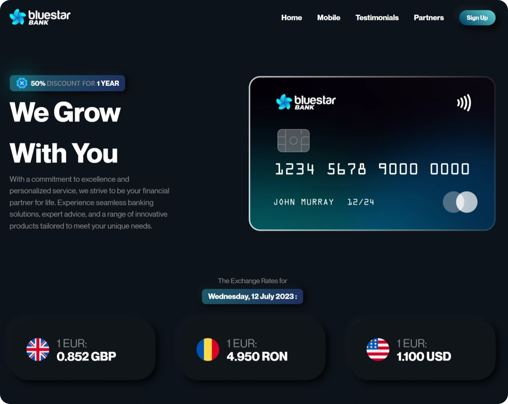
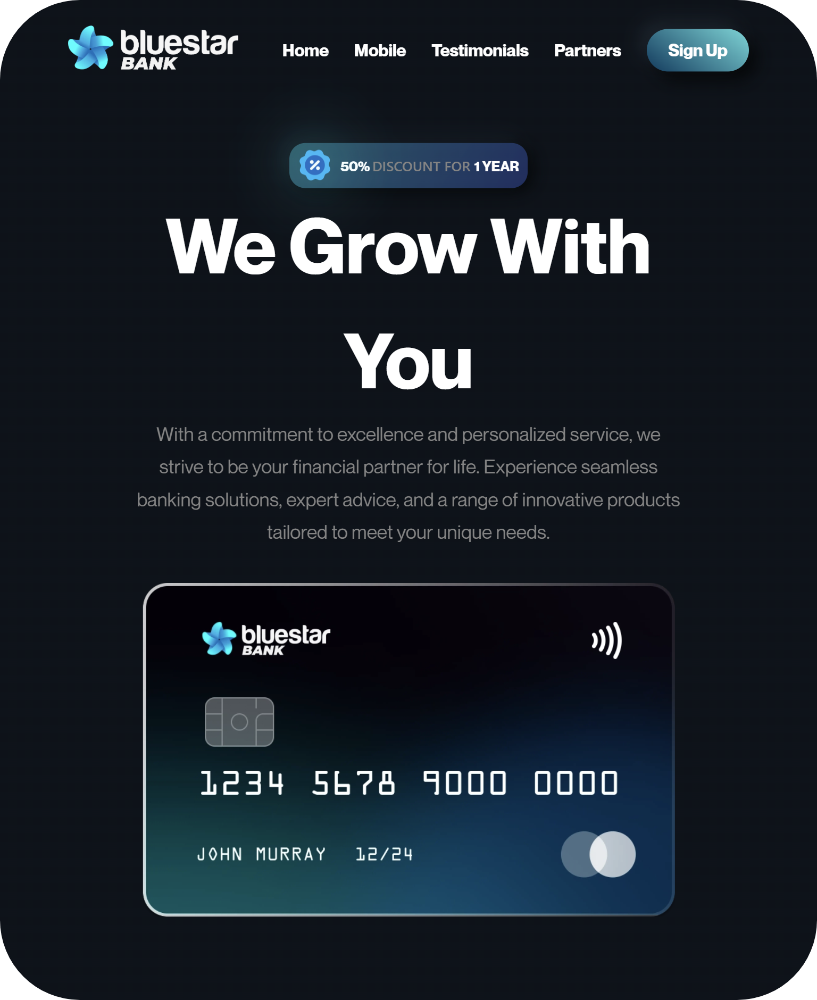
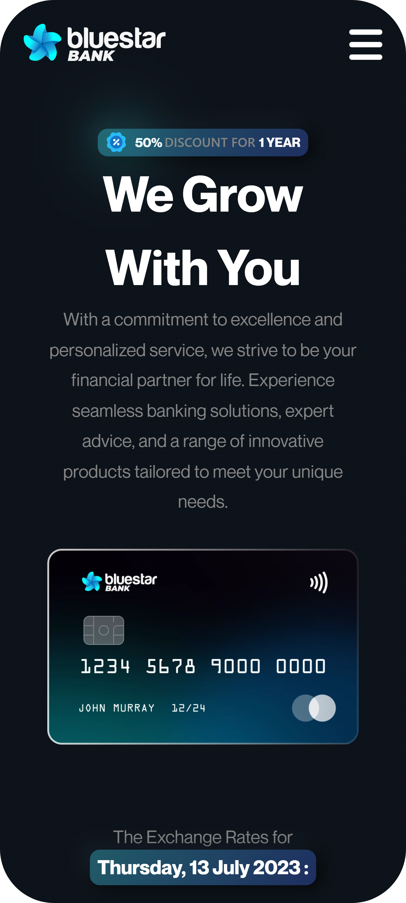

<h1 align="center">A bank website with modern design</h1>

<i>A fully responsive and visually appealing single-page banking application, designed and developed with modern web technologies. This project showcases my proficiency in HTML, CSS, Tailwind CSS, JavaScript, React, Vite, Figma, and Adobe Illustrator. With its intuitive user interface, smooth animations, and real-time exchange rate updates, the Bluestar Bank App provides users with a seamless banking experience.</i>

 

 

<h2 align="left">Key Features</h2>
<ul align="left">  
 <li><b>Responsive Design:</b> The application is designed to adapt seamlessly to various screen sizes and devices, ensuring a consistent user experience.</li>
 <li><b>Intuitive User Interface:</b> The user interface is thoughtfully designed to provide an intuitive and user-friendly banking experience.</li>
 <li><b>Smooth Animations:</b> Delightful animations bring the app to life, enhancing user engagement and making interactions more enjoyable.</li>
 <li><b>Real-time Exchange Rates:</b> Utilizing an API, the Bluestar Bank App dynamically fetches exchange rates and seamlessly integrates them into the user interface, ensuring up-to-date and accurate currency conversion.</li>
 <li><b>Fast and Efficient:</b> The project utilizes Vite, a fast build tool, to provide a highly performant application with minimal load times.</li>
 <li><b>Design-driven Development:</b> Extensive work with Figma and Adobe Illustrator allowed for meticulous design choices and attention to detail, resulting in a visually pleasing and polished interface.</li>
</ul>

<h2 align="left">Technologies Used</h2>
<ul>
  <li>HTML</li>
  <li>CSS</li>
  <li>TailwindCSS</li>
  <li>Javascript</li>
  <li>React</li>
  <li>Vite</li>
  <li>Axios</li>
  <li>RapidAPI</li>
  <li>uuid</li>
  <li>Adobe Illustrator</li>
  <li>Figma</li>
</ul>

<h2 align="left">Usage</h2>

1. Clone the repository:<b> `git clone https://github.com/cristianvsirbu/bank-app.git`</b>
2. Navigate to the project directory:<b> `cd bank-app`</b>
3. Install the dependencies:<b> `npm install`</b>
4. Start the development server:<b> `npm run dev`</b>
5. Open the application in your browser:<b> `http://localhost:3000`</b>

<h2 align="left">Contribution</h2>

Contributions are welcome! If you encounter any issues or have suggestions for improvements, please feel free to submit a pull request or open an issue in the repository. To contribute to the Bluestar Bank App project, follow these steps:

1. Fork the repository and create your branch:<b> `git checkout -b my-feature-branch`</b>
2. Make your changes and commit them:<b> `git commit -m 'Added an awesome feature'`</b>
3. Push to your branch:<b> `git push origin my-feature-branch`</b>
4. Open a pull request in the main repository.😊

